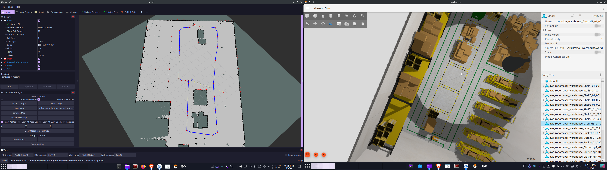

# BumperBot — ROS 2 Autonomous Mobile Robot

> A two-phase autonomous robotics project: occupancy-grid SLAM mapping followed by custom A\*-based autonomous navigation, fully implemented in C++ and simulated in Gazebo under **ROS 2 Jazzy**.

---

## Table of Contents

1. [Project Overview](#1-project-overview)
2. [System Architecture](#2-system-architecture)
3. [Phase 1 — SLAM Mapping](#3-phase-1--slam-mapping)
4. [Phase 2 — Autonomous Navigation](#4-phase-2--autonomous-navigation)
5. [Node Architecture & Communication](#5-node-architecture--communication)
6. [Algorithms Used](#6-algorithms-used)
7. [Package Structure](#7-package-structure)
8. [Dependencies](#8-dependencies)
9. [How to Build](#9-how-to-build)
10. [How to Run](#10-how-to-run)
11. [Simulation Demonstrations](#11-simulation-demonstrations)
12. [Future Improvements](#13-future-improvements)
13. [Technologies Used](#14-technologies-used)

---

## 1. Project Overview

BumperBot is a **differential-drive mobile robot** designed and simulated in Gazebo. The project is split into two self-contained yet tightly integrated phases:

| Phase | Goal | Key Output |
|---|---|---|
| **Phase 1 – Mapping** | Build an accurate occupancy-grid map of an unknown environment | Saved `.pgm` + `.yaml` map files |
| **Phase 2 – Navigation** | Autonomously navigate a pre-mapped environment to a goal pose | Velocity commands on `/bumperbot_controller/cmd_vel` |

Navigation is built as a direct algorithmic extension of the mapping system — the sensor pipeline, odometry model, TF tree, and costmap infrastructure established in Phase 1 form the foundation on which the Phase 2 navigation stack operates. The two phases share the same low-level architecture; navigation adds goal management, path planning, and closed-loop trajectory tracking on top of it.

The entire software stack is written in **C++**, organised as modular ROS 2 packages, and designed for straightforward extension — new planners or controllers can be registered as `pluginlib` plugins without modifying the core navigation stack.

---

## 2. System Architecture

```
┌──────────────────────────────────────────────────────────────────┐
│                        Gazebo Simulation                         │
│   ┌───────────────┐    /scan     ┌──────────────────────────┐   │
│   │  bumperbot    │ ──────────► │   bumperbot_mapping /    │   │
│   │  (URDF/Xacro) │             │   slam_toolbox           │   │
│   │               │ ◄────────── └──────────────────────────┘   │
│   │  /joint_states│  /cmd_vel           │ /map                   │
│   └──────┬────────┘                     ▼                        │
│          │                  ┌─────────────────────┐              │
│          │ /odom            │  bumperbot_navigation│              │
│          ▼                  │  (Nav2 stack)        │              │
│   ┌──────────────┐          │  ┌───────────────────┐  │          │
│   │ SimpleCtrl   │ ◄──────  │  │  Planner Server   │  │          │
│   │ (odometry +  │ /cmd_vel │  │  (SmacPlanner2D)  │  │          │
│   │  TF broadcast│          │  └────────┬──────────┘  │          │
│   └──────────────┘          │           │ /plan        │          │
│                             │  ┌────────▼──────────┐  │          │
│                             │  │ Controller Server │  │          │
│                             │  │ (RegulatedPurePur)│  │          │
│                             │  └────────┬──────────┘  │          │
│                             │          │ /cmd_vel  │              │
│                             │  ┌───────▼────────┐ │              │
│                             │  │ BT Navigator / │ │              │
│                             │  │Behavior Server │ │              │
│                             └──┴────────────────┴─┘              │
└──────────────────────────────────────────────────────────────────┘
```

> **Architecture diagram placeholder** — replace with `docs/architecture.png` once exported from draw.io or equivalent.

---

## 3. Phase 1 — SLAM Mapping

### 3.1 Robot Model

The robot is described as a **modular URDF/Xacro** model (`bumperbot_description`). The kinematic chain uses:

| Link | Type | Notes |
|---|---|---|
| `base_footprint` | Virtual root | Ground contact reference frame |
| `base_link` | Rigid body | Main chassis, mass ≈ 0.826 kg |
| `wheel_right_link` / `wheel_left_link` | Continuous joints | Radius 33 mm, effective separation 170 mm (controller config) |
| `caster_front_link` / `caster_rear_link` | Fixed (sphere collision) | Passive front/rear casters |
| `laser_link` | Fixed sensor frame | LiDAR mounted at +120.8 mm Z |
| `imu_link` | Fixed sensor frame | IMU mounted on chassis top |

The differential-drive kinematics are handled by `ros2_control` with a `simple_velocity_controller`, which accepts wheel angular velocity commands on `/simple_velocity_controller/commands`.

### 3.2 Odometry Estimation

`bumperbot_controller/simple_controller` implements incremental odometry from wheel encoder data (`/joint_states`):

```
d_s     = (r · Δθ_right + r · Δθ_left) / 2        # linear displacement
d_theta = (r · Δθ_right - r · Δθ_left) / wheelbase  # angular displacement

x += d_s · cos(θ)
y += d_s · sin(θ)
```

The pose estimate and corresponding `odom → base_footprint` TF transform are published at each joint-state update cycle on `/bumperbot_controller/odom`.

A probabilistic **odometry motion model** (`bumperbot_localization`) propagates a particle cloud of 300 samples using Gaussian noise parameterised by `(α1..α4)`, providing an observable measure of dead-reckoning uncertainty.

### 3.3 Occupancy-Grid Mapping

`bumperbot_mapping/mapping_with_known_poses` implements a **log-odds occupancy-grid mapper** from scratch:

1. **TF lookup** — at each LiDAR scan, the node queries the `odom → laser_link` transform via `tf2_ros::Buffer`.
2. **Coordinate conversion** — each range beam is converted from polar (robot frame) to Cartesian world coordinates.
3. **Bresenham ray tracing** — a full implementation of the Bresenham line algorithm traces from the robot's grid cell to the beam endpoint, marking intermediate cells as `FREE` and the terminal cell as `OCCUPIED`.
4. **Log-odds update** — per-cell belief is updated in log-odds space:

   ```
   L(cell) += log-odds(p_hit) − log-odds(p_prior)
   ```

5. **Publication** — every 1 second the probability map is converted back to `[0, 100]` occupancy integers and published as `nav_msgs/OccupancyGrid` on `/map`.

Configurable parameters: map `width`, `height`, and `resolution`.

### 3.4 SLAM Session (slam_toolbox)

For the full SLAM workflow (loop-closure + pose-graph optimisation), the `bumperbot_mapping/slam.launch.py` brings up:

- **`slam_toolbox`** (synchronous mode) — subscribes to `/scan` and the TF tree, outputs a continuously refined `/map`.
- **`nav2_map_server/map_saver_server`** — saves the final map to disk as `.pgm` / `.yaml` on request.
- **`nav2_lifecycle_manager`** — manages the lifecycle state of both nodes (configure → activate → run).

The teleop interface (`joystick_teleop.launch.py`) allows manual exploration during the mapping session before the map is persisted.

### 3.5 Mapping Snapshot

> **[`snapshot_map_navigation/map_gz_rviz.png`](snapshot_map_navigation/map_gz_rviz.png)** — Side-by-side view of Gazebo world and the resulting RViz occupancy grid.

---

## 4. Phase 2 — Autonomous Navigation

Navigation is deployed as an extension of the mapping output. The saved map is loaded as the **static costmap layer**, and the Nav2 stack is configured with custom `pluginlib`-registered planners and controllers implemented in this repository.

### 4.1 Global Planning — SmacPlanner2D (Nav2)

The **active** global planner is `nav2_smac_planner::SmacPlanner2D`, configured in `planner_server.yaml`. It runs an optimised 2D A\*-based search over the global costmap with the following parameters active in this project:

- `tolerance: 0.125 m` — goal proximity threshold before declaring success.
- `cost_travel_multiplier: 2.0` — steers paths away from inflation zones and toward aisle centres.
- `allow_unknown: true` — permits traversal through unexplored regions during early navigation.
- Integrated `smoother` (w\_smooth=0.3, w\_data=0.2) — reduces angular jitter in the raw grid path before handoff to the controller.

**Custom planner plugins (implemented, swappable):** A fully custom `AStarPlanner` and `DijkstraPlanner` are implemented in `bumperbot_planning/` and registered as `nav2_core::GlobalPlanner` plugins via `pluginlib`. They can be activated with a single YAML line change — no recompilation required (see [§10.5](#105-switching-planner--controller-plugins)).

The custom `AStarPlanner` uses:
- **Manhattan distance heuristic** (`|Δx| + |Δy|`)
- `std::priority_queue` ordered by `f(n) = g(n) + h(n)`
- Cost-aware edge weights: `g(neighbor) = g(current) + 1 + costmap_cost(neighbor)`
- Cells with cost ≥ 99 (obstacle + inflation lethal zone) are pruned
- Post-planning path smoothing via `nav2_msgs::action::SmoothPath` action call to the smoother server

### 4.2 Local Control — Regulated Pure Pursuit Controller (Nav2)

The **active** local controller is `nav2_regulated_pure_pursuit_controller::RegulatedPurePursuitController`, configured in `controller_server.yaml`. Key parameters active in this project:

| Parameter | Value | Effect |
|---|---|---|
| `desired_linear_vel` | 0.5 m/s | Nominal forward speed |
| `lookahead_dist` | 0.6 m | Base look-ahead distance |
| `min_lookahead_dist` | 0.3 m | Minimum at low speeds |
| `max_lookahead_dist` | 0.9 m | Maximum at high speeds |
| `use_rotate_to_heading` | true | Robot rotates in place to face goal direction before driving |
| `rotate_to_heading_min_angle` | 0.785 rad (~45°) | Threshold to trigger heading rotation |
| `max_angular_accel` | 5.0 rad/s² | Angular acceleration limit |
| `use_regulated_linear_velocity_scaling` | true | Slows down on tight curves |
| `use_collision_detection` | true | Stops if forward path would collide |

Velocity commands are output as `geometry_msgs/TwistStamped` and remapped to `/bumperbot_controller/cmd_vel`.

**Custom controller plugins (implemented, swappable):** Two custom `nav2_core::Controller` plugins are implemented in `bumperbot_motion/`:
- `PDMotionPlanner` — PD error-based controller (kp=2.0, kd=0.1) with carrot-point look-ahead.
- `PurePursuit` — geometric pure pursuit implementation.

Both are registered via `pluginlib` and can replace the active controller with a single YAML change.

### 4.3 Recovery Behaviors

The **`nav2_behaviors/behavior_server`** handles recovery situations. When the BT Navigator detects that progress toward the goal has stalled, it can trigger:

- **Spin** — in-place rotation to escape local minima.
- **Back-Up** — short reverse translation to clear narrow passages.

Recovery velocity commands are remapped to `/bumperbot_controller/cmd_vel` alongside the normal navigation commands.

### 4.4 BT Navigator

Goal lifecycle management is handled by `nav2_bt_navigator`, which executes a behaviour tree that sequences: **compute path → follow path → recover if stuck → succeed or fail**. The BT architecture cleanly separates high-level mission control from low-level planner/controller concerns.

---

## 5. Node Architecture & Communication

### 5.1 Topic Map

| Topic | Type | Producer | Consumer(s) |
|---|---|---|---|
| `/scan` | `sensor_msgs/LaserScan` | Gazebo sim | `slam_toolbox`, `mapping_with_known_poses`, `obstacle_layer` |
| `/joint_states` | `sensor_msgs/JointState` | `ros2_control` | `simple_controller`, `robot_state_publisher` |
| `/bumperbot_controller/odom` | `nav_msgs/Odometry` | `simple_controller` | `odometry_motion_model`, Nav2 stack |
| `/tf` | `tf2_msgs/TFMessage` | `simple_controller`, `robot_state_publisher` | All nodes consuming transforms |
| `/map` | `nav_msgs/OccupancyGrid` | `slam_toolbox` / `map_server` | `global_costmap`, `rviz2` |
| `/plan` | `nav_msgs/Path` | `planner_server` | `controller_server`, `rviz2` |
| `/bumperbot_controller/cmd_vel` | `geometry_msgs/TwistStamped` | `controller_server`, `behavior_server` | `simple_controller` |
| `/simple_velocity_controller/commands` | `std_msgs/Float64MultiArray` | `simple_controller` | `ros2_control` hardware interface |
| `/odometry_motion_model/samples` | `geometry_msgs/PoseArray` | `odometry_motion_model` | `rviz2` (visualisation) |

### 5.2 TF Tree

```
map
 └── odom
      └── base_footprint
           └── base_link
                ├── wheel_right_link
                ├── wheel_left_link
                ├── caster_front_link
                ├── caster_rear_link
                ├── imu_link
                └── laser_link
```

- `map → odom` is managed by `slam_toolbox` (during mapping) or `amcl` (during localisation with a pre-built map).
- `odom → base_footprint` is broadcast by `simple_controller` from wheel encoder integration.
- All remaining static transforms are published by `robot_state_publisher` from the URDF.

### 5.3 Lifecycle Management

All Nav2 server nodes (`controller_server`, `planner_server`, `smoother_server`, `bt_navigator`, `behavior_server`) are **managed nodes** following the ROS 2 lifecycle state machine. They are all started, configured, and activated programmatically by `nav2_lifecycle_manager`, ensuring deterministic startup ordering and clean shutdown.

---

## 6. Algorithms Used

| Algorithm | Location | Purpose |
|---|---|---|
| **SmacPlanner2D** (Nav2 built-in A\*) | `bumperbot_navigation/config/planner_server.yaml` | **Active** global planner |
| **Regulated Pure Pursuit** (Nav2 built-in) | `bumperbot_navigation/config/controller_server.yaml` | **Active** local controller |
| **A\*** (grid-based, 4-connected) | `bumperbot_planning/a_star_planner.cpp` | Custom global planner plugin (swappable) |
| **Dijkstra** (grid-based) | `bumperbot_planning/dijkstra_planner.cpp` | Custom global planner plugin (swappable) |
| **Bresenham Line Algorithm** | `bumperbot_mapping/mapping_with_known_poses.cpp` | Ray-tracing through occupancy grid |
| **Log-Odds Bayesian Update** | `bumperbot_mapping/mapping_with_known_poses.cpp` | Probabilistic cell occupancy belief update |
| **Odometry Motion Model** (probabilistic) | `bumperbot_localization/odometry_motion_model.cpp` | Particle-based dead-reckoning uncertainty |
| **PD Control** | `bumperbot_motion/pd_motion_planner.cpp` | Custom local controller plugin (swappable) |
| **Pure Pursuit** | `bumperbot_motion/pure_pursuit.cpp` | Custom local controller plugin (swappable) |
| **Differential Drive Kinematics** | `bumperbot_controller/simple_controller.cpp` | Wheel velocity ↔ body velocity conversion |
| **Kalman Filter** | `bumperbot_localization/kalman_filter.cpp` | IMU / odometry sensor fusion |

---

## 7. Package Structure

```
bumperbo_Ws/
├── snapshot_map_navigation/
│   ├── map_gz_rviz.png               # Mapping result snapshot
│   └── autonomous_navigation.mp4     # Navigation demo video
└── src/
    ├── bumperbot_bringup/            # Top-level launch files
    │   └── launch/
    │       ├── simulated_robot.launch.py
    │       └── real_robot.launch.py
    ├── bumperbot_description/        # Robot model (URDF/Xacro, meshes, Gazebo worlds)
    │   ├── urdf/
    │   │   ├── bumperbot.urdf.xacro
    │   │   ├── bumperbot_gazebo.xacro
    │   │   └── bumperbot_ros2_control.xacro
    │   ├── meshes/                   # STL mesh files
    │   └── worlds/                   # Gazebo world files
    ├── bumperbot_controller/         # Low-level drive controller + odometry
    │   └── src/
    │       ├── simple_controller.cpp # Encoder odometry + TF + cmd_vel relay
    │       └── noisy_controller.cpp  # Odometry with configurable noise injection
    ├── bumperbot_localization/       # Localisation utilities
    │   └── src/
    │       ├── odometry_motion_model.cpp  # Probabilistic particle propagation
    │       ├── kalman_filter.cpp          # IMU/odometry fusion
    │       └── imu_republisher.cpp
    ├── bumperbot_mapping/            # Occupancy-grid mapping
    │   └── src/
    │       └── mapping_with_known_poses.cpp  # Log-odds Bayesian mapper
    ├── bumperbot_planning/           # Global planner plugins (Nav2)
    │   └── src/
    │       ├── a_star_planner.cpp    # A* with Manhattan heuristic + smoothing
    │       └── dijkstra_planner.cpp  # Dijkstra alternative
    ├── bumperbot_motion/             # Local controller plugins (Nav2)
    │   └── src/
    │       ├── pd_motion_planner.cpp # PD error-based path tracker
    │       └── pure_pursuit.cpp      # Geometric look-ahead controller
    ├── bumperbot_navigation/         # Nav2 configuration + launch
    │   ├── config/
    │   │   ├── planner_server.yaml
    │   │   ├── controller_server.yaml
    │   │   ├── behavior_server.yaml
    │   │   ├── bt_navigator.yaml
    │   │   ├── smoother_server.yaml
    │   │   └── costmap.yaml
    │   └── launch/
    │       └── navigation.launch.py
    ├── bumperbot_msgs/               # Custom message/service definitions
    ├── bumperbot_utils/              # Utilities (safety stop, etc.)
    ├── bumperbot_firmware/           # Embedded firmware (real hardware)
    ├── bumperbot_cpp_examples/       # Standalone ROS 2 C++ examples
    ├── bumperbot_py_examples/        # Standalone ROS 2 Python examples
    └── twist_relay/                  # Twist topic relay/remapping utility
```

---

## 8. Dependencies

| Dependency | Version | Purpose |
|---|---|---|
| ROS 2 | Jazzy | Core middleware |
| Gazebo | (Jazzy default) | Physics simulation |
| `slam_toolbox` | ROS 2 Jazzy | Full SLAM (loop closure, pose graph) |
| `nav2_*` | ROS 2 Jazzy | Navigation stack (planner, controller, BT) |
| `ros2_control` | ROS 2 Jazzy | Hardware abstraction / controller manager |
| `tf2` / `tf2_ros` | ROS 2 Jazzy | Transform tree management |
| `Eigen3` | ≥ 3.3 | Matrix math for kinematics in `simple_controller` |
| `pluginlib` | ROS 2 Jazzy | Plugin registration for planners / controllers |

All ROS 2 dependencies are declared in each package's `package.xml` and resolved via `rosdep`.

---

## 9. How to Build

```bash
# 1. Clone the workspace
git clone <repo-url> bumperbo_Ws
cd bumperbo_Ws

# 2. Install system-level ROS 2 dependencies
sudo apt update
rosdep update
rosdep install --from-paths src --ignore-src -r -y

# 3. Build all packages
colcon build --symlink-install

# 4. Source the workspace overlay
source install/setup.bash
```

> **Tip:** Add `source ~/bumperbo_Ws/install/setup.bash` to your `~/.bashrc` to avoid sourcing manually on every terminal session.

---

## 10. How to Run

### 10.1 Phase 1 — Mapping Session

**Step 1** — Launch Gazebo, the robot, and the SLAM stack:

```bash
ros2 launch bumperbot_bringup simulated_robot.launch.py use_slam:=true use_teleop:=true
```

This single command brings up:
- Gazebo with the BumperBot world
- `ros2_control` + `simple_controller` (odometry + TF)
- `slam_toolbox` (synchronous SLAM)
- Joystick / teleop interface
- RViz2 with Nav2 default view

**Step 2** — Drive the robot to explore the environment. The `/map` topic will update in real time in RViz2.

**Step 3** — Save the map once satisfied with coverage:

```bash
ros2 service call /map_saver/save_map nav2_msgs/srv/SaveMap \
  "{map_topic: /map, map_url: src/bumperbot_mapping/maps/my_map, \
    image_format: pgm, map_mode: trinary, free_thresh: 0.196, occupied_thresh: 0.65}"
```

---

### 10.2 Phase 2 — Autonomous Navigation

**Step 1** — Launch the robot in navigation mode (uses AMCL localisation + pre-built map):

```bash
ros2 launch bumperbot_bringup simulated_robot.launch.py
```

**Step 2** — Launch the Nav2 navigation stack:

```bash
ros2 launch bumperbot_navigation navigation.launch.py
```

> **RViz2 launches pre-configured.** The bringup file loads `/opt/ros/jazzy/share/nav2_bringup/rviz/nav2_default_view.rviz` automatically — all Nav2 panels (Global Costmap, Local Costmap, Path, Pose) are already set up. No manual topic configuration required.

**Step 3** — Set the robot's initial pose in RViz2 using the **2D Pose Estimate** tool.

**Step 4** — Send a navigation goal using the **Nav2 Goal** tool in RViz2, or programmatically:

```bash
ros2 topic pub --once /goal_pose geometry_msgs/PoseStamped \
  "{header: {frame_id: 'map'}, pose: {position: {x: 2.0, y: 1.5, z: 0.0}, \
    orientation: {w: 1.0}}}"
```

---

### 10.2.1 Manual Override During Autonomous Navigation

The stack uses **`twist_mux`** to arbitrate between velocity sources. Command sources are prioritised as follows:

| Source | Topic | Priority |
|---|---|---|
| Joystick | `joy_vel` | 99 (highest) |
| Keyboard | `key_vel` | 90 |
| Nav2 navigation | `cmd_vel` | 80 (lowest) |

To manually drive the robot while autonomous navigation is running, launch with the `use_teleop` flag:

```bash
ros2 launch bumperbot_bringup simulated_robot.launch.py use_teleop:=true
```

Joystick or keyboard input will immediately override autonomous velocity commands for as long as input is being sent. Once the input times out (0.5 s), `twist_mux` automatically hands control back to the navigation stack — no manual intervention required.

---

### 10.3 Mapping + Navigation in the Same Session (SLAM Nav)

```bash
ros2 launch bumperbot_bringup simulated_robot.launch.py \
  use_slam:=true

ros2 launch bumperbot_navigation navigation.launch.py
```

This configuration runs SLAM and navigation concurrently — the robot can navigate to goals while simultaneously refining the map.

---

### 10.4 Running the Custom Mapper Standalone

```bash
ros2 run bumperbot_mapping mapping_with_known_poses \
  --ros-args -p width:=50.0 -p height:=50.0 -p resolution:=0.1
```

---

### 10.5 Switching Planner / Controller Plugins

**Switch to the custom A\* planner** — edit `bumperbot_navigation/config/planner_server.yaml`:

```yaml
# Change GridBased plugin from SmacPlanner2D to the custom A*:
GridBased:
  plugin: "bumperbot_planning::AStarPlanner"

# Or Dijkstra:
# plugin: "bumperbot_planning::DijkstraPlanner"
```

**Switch to the custom PD motion planner** — edit `bumperbot_navigation/config/controller_server.yaml`:

```yaml
# Change FollowPath plugin from RegulatedPurePursuitController:
FollowPath:
  plugin: "bumperbot_motion::PDMotionPlanner"
  kp: 2.0
  kd: 0.1
  max_linear_velocity: 0.3
  max_angular_velocity: 1.0
  step_size: 0.2

# Or the custom geometric Pure Pursuit:
# plugin: "bumperbot_motion::PurePursuit"
```

No recompilation required — `pluginlib` loads the selected implementation at runtime. The custom plugins are already built and registered.

---

## 11. Simulation Demonstrations

All demonstration media is stored under `snapshot_map_navigation/`.

### Mapping Session



*Gazebo environment (left) alongside the resulting occupancy grid visualised in RViz2 (right). The dark cells represent occupied space, light cells are free space, and grey represents unexplored regions.*

### Autonomous Navigation

<video src="snapshot_map_navigation/autonomous_navigation.mp4" controls width="100%">
  <a href="snapshot_map_navigation/autonomous_navigation.mp4">autonomous_navigation.mp4</a>
</video>

*Goal pose set via RViz2. SmacPlanner2D computes a collision-free path through the costmap; the Regulated Pure Pursuit controller tracks it to completion. Recovery behaviours (spin / back-up) are triggered automatically if the robot stalls.*

---

## 12. Future Improvements

The current implementation provides a solid foundation for extension. Planned areas of improvement include:

- **AMCL → SLAM continuous localisation** — replace static-map AMCL with a continuous SLAM session for long-duration operation in dynamic environments.
- **Dynamic obstacle avoidance** — integrate the `nav2_costmap_2d` dynamic obstacle layer with real-time laser updates into the local planner.
- **3D perception** — mount a depth camera on the robot model and fuse point-cloud data with the existing LiDAR-based costmap layers.
- **Multi-goal mission planning** — implement a waypoint sequencer that chains navigation goals and handles per-waypoint actions (e.g., stop, rotate, record sensor data).
- **Real hardware deployment** — validate the entire software stack on physical hardware using the `bumperbot_firmware` package and the `real_robot.launch.py` bringup file.
- **Formal path-smoothing** — replace the `simple_smoother` post-processing step with an integrated spline-based planner that satisfies kinematic constraints natively.
- **Adaptive PD tuning** — replace fixed `kp`/`kd` gains with an auto-tuning mechanism that adapts to surface conditions detected from wheel slip estimation.
- **Behaviour Tree customisation** — author custom BT XML trees beyond the Nav2 defaults to support more complex mission profiles (conditional docking, room-by-room coverage, etc.).

---

## 13. Technologies Used

| Technology | Role |
|---|---|
| **ROS 2 Jazzy** | Core middleware, node communication, lifecycle management |
| **C++ (C++17)** | All node and plugin implementations |
| **Gazebo** | Physics-based simulation environment |
| **URDF / Xacro** | Robot kinematic and visual model |
| **`ros2_control`** | Hardware abstraction layer for wheel velocity control |
| **`slam_toolbox`** | Graph-based SLAM with loop closure |
| **Nav2** (`nav2_planner`, `nav2_controller`, `nav2_behaviors`, `nav2_bt_navigator`, `nav2_smoother`) | Modular autonomous navigation stack |
| **`nav2_costmap_2d`** | Static + obstacle + inflation costmap layers |
| **`pluginlib`** | Runtime plugin registration for planners and controllers |
| **`tf2` / `tf2_ros`** | Coordinate frame management and transform lookup |
| **Eigen3** | Linear algebra for differential drive kinematics inversion |
| **`ament_cmake`** | ROS 2 CMake build system |

---

*Built with ROS 2 Jazzy · Simulated in Gazebo · Implemented in C++*
