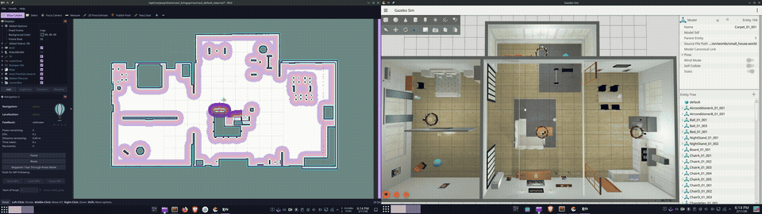

# BumperBot — ROS 2 Autonomous Mobile Robot

> A full-stack autonomous mobile robotics project built in **ROS 2 Jazzy** and **Gazebo** — from scratch occupancy-grid SLAM mapping through to goal-driven autonomous navigation with custom C++ planning and control plugins.

---

## Overview

BumperBot is a **differential-drive robot** that progresses through two tightly integrated phases: first building an accurate occupancy-grid map of an unknown environment using a custom log-odds Bayesian mapper and `slam_toolbox`, then autonomously navigating that environment using the Nav2 stack configured with custom `pluginlib`-registered planners and controllers implemented in C++. The entire software stack — robot model, odometry, mapping, planning, and control — is written from the ground up, with the navigation layer built as a direct algorithmic extension of the mapping infrastructure.

> Built to demonstrate end-to-end autonomous robotics: sensor integration, probabilistic mapping, path planning, and closed-loop trajectory tracking — all in a modular, production-structured ROS 2 workspace.

---

## System Architecture

<!-- Replace with exported architecture diagram -->
> **Architecture diagram** — see [`PROJECT_DETAILS.md`](PROJECT_DETAILS.md#2-system-architecture) for the full annotated data-flow diagram.

---

## Demonstrations

### Phase 1 — SLAM Mapping


*Gazebo simulation environment (left) alongside the resulting occupancy grid in RViz2 (right). Generated using a custom log-odds Bayesian mapper with Bresenham ray tracing.*

---

### Phase 2 — Autonomous Navigation



*Goal set via RViz2 Nav2 Goal tool → SmacPlanner2D computes path → Regulated Pure Pursuit controller tracks it → recovery behaviours triggered automatically on stall.*

> Full quality video: [`autonomous_navigation.mp4`](snapshot_map_navigation/autonomous_navigation.mp4)

---

## Technologies Used

- **ROS 2 Jazzy** — middleware, lifecycle management, TF tree
- **Gazebo** — physics simulation
- **C++ (C++17)** — all nodes and plugins
- **URDF / Xacro** — robot model with STL meshes
- **`ros2_control`** — hardware abstraction, wheel velocity control
- **`slam_toolbox`** — graph-based SLAM with loop closure
- **Nav2** — planning, control, behaviour trees, recovery
- **`pluginlib`** — runtime swappable planner and controller plugins
- **`tf2`** — coordinate frame management
- **Eigen3** — differential drive kinematics

---

## Quick Start

### Build

```bash
git clone <repo-url> bumperbo_Ws && cd bumperbo_Ws
rosdep install --from-paths src --ignore-src -r -y
colcon build --symlink-install
source install/setup.bash
```

### Run — Mapping Session

```bash
ros2 launch bumperbot_bringup simulated_robot.launch.py use_slam:=true use_teleop:=true
```

Drive the robot to explore, then save the map:

```bash
ros2 service call /map_saver/save_map nav2_msgs/srv/SaveMap \
  "{map_topic: /map, map_url: src/bumperbot_mapping/maps/my_map, \
    image_format: pgm, map_mode: trinary, free_thresh: 0.196, occupied_thresh: 0.65}"
```

### Run — Autonomous Navigation

The Nav2 stack is embedded inside the bringup launch file — a **single command** starts Gazebo, the robot, localisation, Nav2, and RViz2:

```bash
ros2 launch bumperbot_bringup simulated_robot.launch.py
```

To select a specific world (default is `empty.world`):

```bash
# Available worlds: empty.world | small_house.world | small_warehouse.world
ros2 launch bumperbot_bringup simulated_robot.launch.py world_name:=small_house.world
```

RViz2 launches pre-configured — no topic setup needed. Set initial pose with **2D Pose Estimate**, then place a **Nav2 Goal** to start navigation.

### Manual Override During Autonomous Navigation

```bash
ros2 launch bumperbot_bringup simulated_robot.launch.py use_teleop:=true
```

Joystick input overrides autonomous commands via `twist_mux` (priority 99). Control returns to Nav2 automatically after 0.5 s of inactivity.

---

## Repository Structure

```
bumperbo_Ws/
├── snapshot_map_navigation/    # Demo media (map image + navigation video)
└── src/
    ├── bumperbot_bringup/      # Top-level launch files
    ├── bumperbot_description/  # URDF/Xacro robot model + meshes + worlds
    ├── bumperbot_controller/   # Low-level drive controller + odometry
    ├── bumperbot_localization/ # Odometry motion model + Kalman filter
    ├── bumperbot_mapping/      # Custom log-odds occupancy-grid mapper
    ├── bumperbot_planning/     # Custom A* + Dijkstra planner plugins
    ├── bumperbot_motion/       # Custom PD + Pure Pursuit controller plugins
    ├── bumperbot_navigation/   # Nav2 config (YAML) + launch
    ├── bumperbot_msgs/         # Custom message definitions
    └── bumperbot_utils/        # Safety stop and utilities
```

---

For the full technical breakdown — algorithms, node architecture, topic map, TF tree, costmap configuration, and plugin switching — see **[PROJECT_DETAILS.md](PROJECT_DETAILS.md)**.
